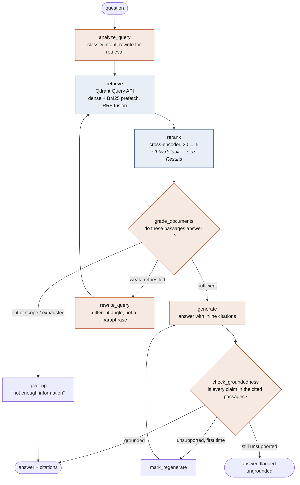

# Ask the Docs

**Agentic RAG with hybrid retrieval and self-correction — over the Claude API / LangGraph / Qdrant documentation, or over your own uploaded files.**

Retrieval is hybrid: dense embeddings and BM25 run as two prefetches in a single
Qdrant query and are fused by rank. Generation runs inside a LangGraph state
machine that grades its own retrieval, rewrites the query and searches again
when the passages are too weak, and checks the finished answer against its own
citations before returning it.

Every layer is measured: retrieval against hand-labelled relevance judgements,
generation against RAGAS, both wired into a CI gate. The measurement is not
decorative — **it is why cross-encoder reranking is implemented but shipped
disabled.** The ablation below shows it lowering MRR on this corpus while
costing 57× the retrieval latency, so it is off by default and one flag away.

From the browser you can **upload your own PDFs or Markdown**, pick which of
**seven embedding models** retrieves them, choose a **reranker**, and answer with
**Claude, Gemini, GPT or a local Ollama model** — each with its own key, supplied
per request and never stored.

🔗 **Live demo:** _not yet deployed — see [docs/deployment.md](docs/deployment.md)_

---

## Architecture



Orange nodes call an LLM; blue nodes run local models only. Full walkthrough in
[docs/architecture.md](docs/architecture.md); the UI is described in
[docs/frontend.md](docs/frontend.md).

---

## Results

<!-- RESULTS:START -->

### Retrieval

Measured on 5,199 chunks from 75 documentation pages, against 44 hand-labelled questions. No LLM involved — these numbers are deterministic and cost nothing to reproduce.

| Configuration | Embedding | hit@1 | hit@3 | hit@5 | recall@5 | mrr | ndcg@10 | p50_ms |
|---|---|---|---|---|---|---|---|---|
| dense only (naive) | bge-small | 0.875 | 1.000 | 1.000 | 1.000 | 0.938 | 0.954 | 49 |
| + sparse / RRF fusion | bge-small | 1.000 | 1.000 | 1.000 | 1.000 | 1.000 | 1.000 | 212 |
| + cross-encoder rerank | bge-small | 0.750 | 1.000 | 1.000 | 1.000 | 0.875 | 0.908 | 10028 |

`hit@k` is the share of questions with a correct page in the top k — the ceiling on what generation can get right. `mrr` rewards ranking the answer first. `p50_ms` is retrieval latency only, excluding generation.


**Reading this table.**

- Adding the BM25 arm moves hit@1 from 0.875 to 1.000 and MRR from 0.938 to 1.000. Fusion is not finding pages dense retrieval missed — it is putting the right page **first**, which is what matters when only the top few reach the prompt.
- **The cross-encoder does not earn its place on this corpus.** It lowers MRR from 1.000 to 0.875 and hit@1 from 1.000 to 0.750, while costing 47× the latency (212 ms → 10028 ms on CPU). It does reach hit@5 1.000 against 1.000, but 10.0 s per query is not a trade worth making for that.
- The likely reason is headroom. Dense retrieval alone already reaches hit@5 1.000 here, so there is almost nothing left for a reranker to fix. Cross-encoders earn their cost on larger, noisier collections where the top 20 contain real distractors — and on hardware where they are not running on a laptop CPU.
- So **reranking ships disabled by default** (`RERANKER_MODEL=none`) and stays one flag away. Leaving it on would mean claiming a component this measurement does not support.

_This is what the eval harness is for. The ablation was built to justify the architecture, and on this corpus it declined to justify one third of it._


### Generation

Judged by `gemini-3.1-flash-lite`, generating with `gemini-3.5-flash-lite`, over 8 answerable questions.

| Configuration | Faithfulness | Answer Relevancy | Context Precision | Context Recall | Correct abstentions | p50 latency |
|---|---|---|---|---|---|---|
| naive | 0.885 | 0.525 | 0.333 | 0.375 | 0/0 | 1645 ms |
| agentic | 1.000 | 0.882 | 0.000 | 0.542 | 0/0 | 13037 ms |

<!-- RESULTS:END -->

---

## Stack

| Layer | Choice | Why this one |
|---|---|---|
| Vector DB | **Qdrant** | Dense and sparse vectors on the same point, fused server-side in one Query API call. The alternative is a vector store plus a separate keyword index and a merge step in application code. |
| Sparse | **BM25** via fastembed, `modifier=IDF` | Exact-identifier matching, which dense retrieval is weak at. |
| Fusion | **Reciprocal Rank Fusion** | Combines ranks, not scores — no weight to tune between two incomparable scales. |
| Reranker | **Five options, default off** | Scores query and passage jointly. Measured as not worth its latency on this corpus — see the table above. |
| Embeddings | **Seven self-hosted models**, 384–1024 dim | Selectable per request; each gets its own collection. |
| Orchestration | **LangGraph** | The control flow has cycles and branches; a linear chain cannot express retry-on-bad-retrieval. |
| Generation | **Claude / Gemini / GPT / Ollama** | Chosen at request time from the UI, behind one interface. |
| Eval | **Offline IR metrics + RAGAS + DeepEval** | Retrieval measured without an LLM; generation measured with one. |
| Tracing | **Langfuse** | A span per graph node, with latency and token cost. |

### Swappable retrieval models

Every embedding model gets its **own Qdrant collection**, because vector
dimensionality is fixed when a collection is created — a 768-dim model cannot
query a 384-dim index. The UI shows how many chunks each model has indexed and
disables the ones with none, so you cannot silently select a model that would
return nothing.

| Embedding | Dim | Size | Notes |
|---|---|---|---|
| `bge-small` | 384 | 67 MB | Default. Fastest to index. |
| `minilm` | 384 | 90 MB | What v1 of this project used — kept as a baseline. |
| `bge-base` | 768 | 210 MB | ~3× the index size for a modest gain. |
| `nomic` | 768 | 520 MB | 8k context. |
| `mxbai` | 1024 | 640 MB | Best English quality available via ONNX. |
| `e5-multilingual` | 1024 | 2.2 GB | Non-English corpora. |
| `qwen3` | 1024 | 2.4 GB | Leads open retrieval benchmarks. Needs torch. |

Rerankers: `none` **(default — see Results)**, `minilm-l6` (80 MB),
`bge-base` (1 GB), `jina-v2` (1.1 GB), `bge-v2-m3` (2.3 GB, torch).

```bash
askthedocs index --recreate --embedding mxbai --reranker jina-v2
askthedocs inspect "what does modifier IDF do" --embedding bge-base
```

---

## Quickstart

No Docker, no signup, no vector-database account. Qdrant runs embedded.

```bash
git clone <this repo> && cd ask-the-docs
python -m venv .venv && source .venv/bin/activate   # Windows: .venv\Scripts\activate
pip install -r requirements.txt && pip install -e .

cp .env.example .env        # add ANTHROPIC_API_KEY, or supply a key in the UI

askthedocs scrape           # ~315 pages from the three doc sites (~6 min)
askthedocs index --recreate # chunk, embed, upsert (~5.2k chunks)
askthedocs serve            # http://127.0.0.1:8000
```

First run downloads ~1.1 GB of ONNX weights. After that it is offline apart from
the LLM call.

**Indexing is CPU-bound and takes a while** — roughly 30 minutes on a 6-core
laptop, because every chunk is embedded locally rather than sent to an embedding
API. To get running faster:

```bash
askthedocs index --recreate --only qdrant       # one doc set, ~1.2k chunks
INDEX_MAX_PAGES_PER_SET=10 askthedocs index --recreate
```

Pages the golden set labels are always indexed regardless of the page cap, so a
smaller corpus still evaluates correctly.

### Other commands

```bash
askthedocs inspect "what does modifier IDF do"   # dense vs sparse vs hybrid vs reranked, side by side
askthedocs ask "how do conditional edges work?"  # one run, printed with its trace
askthedocs ask "..." --naive                     # same question through the baseline
askthedocs eval                                  # score every configuration
```

`inspect` is the one worth running first — it prints the four rankings side by
side and shows the cases where they disagree.

### Running against a real Qdrant

```bash
docker compose up -d
export QDRANT_URL=http://localhost:6333
askthedocs index --recreate
```

---

## Bring your own documents

Drop PDFs, Markdown, plain text or HTML into the sidebar. They are parsed,
chunked with the same heading-aware splitter the documentation corpus uses, and
embedded locally — nothing leaves the machine except the final LLM call.

Uploads land in a **separate collection per workspace and embedding model**, so
your files never mix into the shared documentation index, and clearing them is
one call rather than a re-index. Scanned PDFs are rejected with an explanation
rather than indexed as empty pages; encrypted ones are detected instead of
silently extracting nothing.

## Bring your own model

The provider is chosen per request from the sidebar — Anthropic, Google Gemini,
OpenAI, or a local Ollama. A key pasted into the UI is used to build the model
for that one request and then dropped: never written to disk, never logged,
never attached to a trace. With no key in the UI the server falls back to its
environment, which is how the eval harness and a deployed instance run.

Generation and grading are separate models. The grader fires on every query
**and** on every golden question during an eval run, so it is the single biggest
lever on what evaluation costs — point it at the cheapest model that still
grades reliably (`claude-sonnet-5` against `claude-opus-5` by default).

Provider ids are LangChain package names, which is not what anyone types, so the
obvious vendor names are accepted too:

```bash
LLM_PROVIDER=gemini            # -> google_genai
LLM_MODEL=gemini-2.5-flash-lite
GRADER_MODEL=gemini-2.5-flash-lite   # already the cheapest in its family
```

`claude` → anthropic, `gpt` → openai, `google`/`gemini` → google_genai,
`local` → ollama.

**A note on free-tier quotas, learned the hard way.** Gemini meters free-tier
requests *per model per day*, which has two consequences worth knowing before
you run an eval:

- **Superseded models get their allocation cut.** `gemini-2.5-flash-lite` is
  capped at **20 requests/day**, against ~500 for the current `3.5-flash-lite`.
  One eval run exhausts it after about five questions.
- **Separate models draw from separate buckets.** Pointing `LLM_MODEL` and
  `GRADER_MODEL` at two different models roughly doubles how far a single run
  gets, at no cost to quality when both are the same class.

```bash
LLM_PROVIDER=gemini
LLM_MODEL=gemini-3.5-flash-lite
GRADER_MODEL=gemini-3.1-flash-lite   # a second daily bucket
```

The eval harness detects a quota refusal and stops with the arithmetic — how
many questions completed, how many calls a full run needs — rather than letting
the SDK retry a daily cap that will not clear for hours.

---

## Evaluation

Two halves, split deliberately.

**Retrieval — no LLM, no cost, deterministic.** The golden set labels which
documentation *pages* answer each question, so recall, MRR and nDCG are computed
by comparing retrieved URLs against those labels. Page-level rather than
chunk-level, because chunk ids change whenever chunking changes and would
silently rot. This half runs in CI on every push.

**Generation — needs a judge model, costs money.** RAGAS scores faithfulness,
answer relevancy, context precision and context recall. The judge is the grader
model, not the generator — scoring an answer with the model that wrote it
inflates the result. RAGAS's relevancy metric is pointed at this project's own
local embeddings rather than its OpenAI default, so evaluating a Claude run does
not require an OpenAI key.

The golden set is **44 hand-written questions**: 40 answerable across the three
doc sets, plus 4 deliberately out of scope. The negatives matter — a pipeline
that answers everything confidently posts good faithfulness on the answerable
set while being useless in practice, so correct abstentions are tracked
separately from RAGAS.

Questions and reference answers are written by hand, not generated. Generating
questions with a model and then grading with a model measures how
self-consistent one model is, not whether the system works.

```bash
askthedocs eval                 # retrieval always; generation too if a key is set
pytest                          # tier 1: free retrieval gate
pytest -m eval                  # tier 2: LLM-judged generation gate
```

[.github/workflows/ci.yml](.github/workflows/ci.yml) fails the build when
retrieval drops below its floor, on every push. The generation gate is manual
dispatch, because a gate that bills you on every commit gets switched off.

---

## Design decisions

### Hybrid search instead of dense-only

Dense retrieval handles paraphrase well and rare literal tokens badly. Ask for
`Modifier.IDF` and a bi-encoder returns everything about sparse vectors in
roughly topical order, because the identifier itself carries little semantic
signal. BM25 matches the token exactly. Documentation questions are full of
exact identifiers — parameter names, enum values, class names — so the two
failure modes are complementary, which is the argument for fusing them rather
than choosing one.

Fusion is by rank, not score. Cosine similarity is bounded in [-1, 1] and BM25 is
unbounded, so any weighted sum of the raw numbers is an arbitrary constant that
has to be retuned whenever either model changes. RRF has no such knob. Qdrant
also offers distribution-based score fusion; RRF is the default here because it
needs no per-corpus tuning.

One trap worth naming: fastembed's BM25 emits term frequencies only. Without
`modifier=Modifier.IDF` on the sparse vector config, Qdrant never applies the
inverse-document-frequency term and the sparse arm silently degrades to raw term
frequency. It still returns results, which is what makes it easy to ship.

### Reranking: built, measured, switched off

A bi-encoder embeds query and passage separately and compares the two vectors;
it never sees them together. A cross-encoder runs one forward pass over the pair
and is substantially more accurate in general — and has no index, so its cost is
linear in candidates. The design is sound: fusion decides what is plausible (20
candidates), the cross-encoder decides what is best (5).

On this corpus it did not pay off. Dense retrieval alone already reaches
hit@5 = 1.000, so there is nothing left to fix, and reordering a list that is
already correct can only move the right answer down — which is exactly what the
numbers show (MRR 0.918 → 0.871). It also costs 8.9 s per query on this CPU
against 155 ms without it.

So it ships as `RERANKER_MODEL=none`, with five models available behind the
flag. The general claim — cross-encoders beat bi-encoders — is true and is not
what was tested; what was tested is whether it helps *here*, and it does not.
A corpus with real distractors in the top 20, or a GPU, would likely flip that,
which is why the code and the ablation both stay.

### Self-correction instead of top-k-and-hope

Without a grading step, whatever retrieval returned goes into the prompt and the
model writes a confident answer from it. Retrieval failures then surface as
fluent, wrong answers — the expensive failure mode, because nothing in the
output signals that anything went wrong.

So the graph grades its own retrieval before generating, and on a weak result
rewrites the query and tries again rather than proceeding. The rewrite prompt
asks for a genuinely different angle rather than a paraphrase, because
rephrasing a query that already failed tends to retrieve the same passages.
After at most two retries it returns "not enough information" instead of
guessing. Abstaining is a feature with a measurable cost — `false_refusal_rate`
in the eval output is what stops it being a free win.

### Checking groundedness separately from grading

Grading catches bad retrieval. The groundedness check catches the other failure:
good passages, and a model that embellished anyway. It re-reads the finished
answer against the cited passages and names unsupported claims. One repair
attempt is allowed; if the second is still unsupported the answer is returned
with `grounded: false` and the UI flags it, rather than being suppressed. A
flagged partially-correct answer is more useful than a silent refusal.

### Alternatives considered for the vector store

| | Why not | Why Qdrant |
|---|---|---|
| **pgvector** | Strongest operational argument of the three — most teams already run Postgres and would rather not add a stateful system. But it has no native sparse vectors and no rank fusion, so hybrid search becomes hand-rolled `tsvector` plus your own merge, which is exactly the code this project is trying not to write. | Dense + sparse on one point, fused server-side in one call. |
| **Pinecone** | Managed, so there is no self-hosting story and no infra to reason about; it also bills per index-hour. Hybrid exists but the whole stack becomes a vendor API. | Apache 2.0, runs embedded, in Docker, or managed — same code path. |
| **Qdrant** | — | Native `prefetch` + RRF, payload filters, and an embedded mode that needs no infrastructure at all. |

If this project were a feature inside an existing Postgres app, pgvector would
be the right answer and the hybrid layer would be worth hand-rolling. As a
standalone retrieval system where fusion quality is the point, it is not.

### Two model profiles, and what actually costs time

This was built on a 7.3 GB laptop with no GPU. Under the `quality` profile the
dense model and the cross-encoder are ~2.4 GB each, which does not fit alongside
everything else, so the rerank node explicitly releases the cross-encoder's
weights after scoring rather than holding both resident. The `lite` profile runs
quantised ONNX through fastembed in ~1.5 GB and is what the container ships.

Three findings from making indexing usable, all measured rather than assumed:

1. **Chunk length dominates embedding cost, not core count.** Attention is
   O(n²), so throughput collapses as chunks get longer: 254 chunks/s at 50
   characters, 45 at 200, 10 at 800, and 2 on real code-heavy chunks that
   tokenise near the model's 512-token limit. Halving `CHUNK_SIZE` was worth
   more than any threading change.
2. **fastembed's `parallel=0` made it slower on Windows.** It forks workers, and
   under spawn semantics each one reloads the ONNX model. ONNX Runtime's own
   intra-op threading changed nothing either — the work is not thread-bound.
3. **Never put the embedded index in a synced folder.** Qdrant's local mode
   commits to SQLite once per point; with the store inside OneDrive, the sync
   client re-uploaded the whole growing file after every commit and indexing
   took hours. The default store path is now a cache directory outside the repo.

### Qdrant embedded by default

The default configuration has no infrastructure at all — no Docker, no account.
Setting `QDRANT_URL` switches the same code path to a real server. Embedded mode
has one documented divergence: on the sparse arm it keeps points scoring exactly
0.0 where the server drops them. Under RRF's `1/(k + rank)` with `k=2`, such a
point at the tail of a 40-candidate prefetch contributes `1/41` against `1/2` for
a top hit, so it is tail noise rather than a change to the ranking's head.

### Langfuse Cloud rather than self-hosted

Langfuse v3+ publishes a floor of 4+ CPU cores and 16 GiB RAM — ClickHouse alone
asks for 8 GiB and fails to start below 4. That is more than twice this machine,
so the default points at the Cloud free tier.
[docker-compose.langfuse.yml](docker-compose.langfuse.yml) carries the full
self-hosted stack for hardware that can hold it, because "self-hostable" is only
a real claim if the compose file exists. Tracing degrades to a no-op when no
keys are set: an observability layer that can take the request path down is
worse than none.

---

## Project layout

```
src/askthedocs/
  config.py          embedding + reranker registries, tunables, eval configs
  llm.py             provider-agnostic model factory (Claude/Gemini/GPT/Ollama)
  ingest/
    sources.py       which documentation pages to fetch, and in what priority
    scrape.py        sitemap → markdown (Mintlify .md, else HTML extraction)
    chunk.py         heading-aware splitting with breadcrumbs
    upload.py        user files: PDF/MD/TXT/HTML → the same chunker
  retrieval/         encoders (ONNX + torch), Qdrant hybrid search
  graph/             LangGraph nodes, prompts, both topologies
  api/               FastAPI: JSON, SSE streaming, uploads
  evals/             golden set, offline IR metrics, RAGAS, DeepEval judge
  observability/     Langfuse
frontend/            single-page chat UI, no build step
tests/               tier 1 (free) and tier 2 (@pytest.mark.eval)
legacy/              the v1 Streamlit app this replaced
```

## Tests

```bash
pytest -m "not eval"    # 82 tests, no API key, no network
pytest -m eval          # adds the LLM-judged gate (costs money)
```

The suite points embedded Qdrant at a temporary directory, so it never collides
with a running server or a live index, and can never write into one.

---

## What v1 was

The original was a Streamlit app: upload a PDF, embed with MiniLM into in-memory
FAISS, answer with a local `flan-t5-base` through `RetrievalQA`. Dense-only
top-k, no citations, no evaluation, index rebuilt on every upload. It is kept in
[legacy/](legacy/) for comparison.
