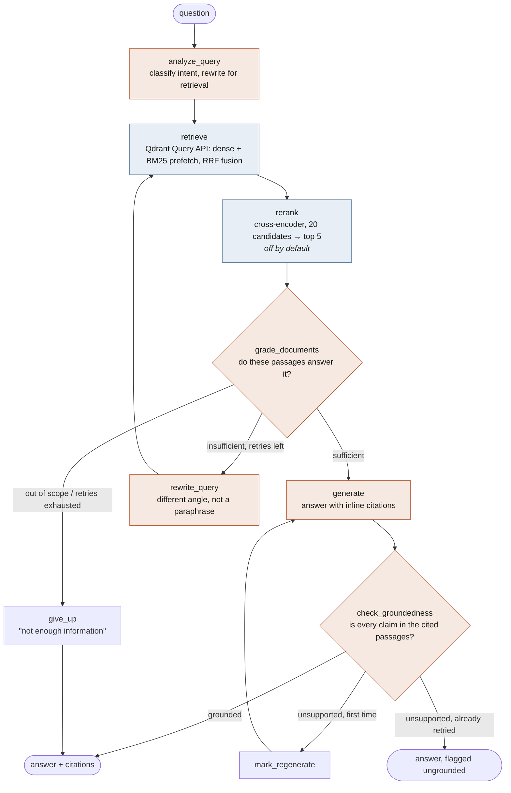
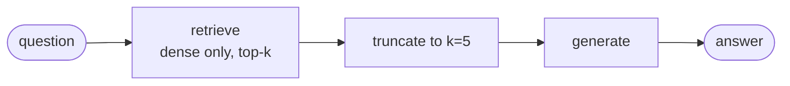

# Architecture

## The graph



Orange nodes make an LLM call; blue nodes are local models only.

The baseline configuration that the eval table calls "naive" is the same code
with the conditional machinery removed:



Both are built by `graph/build.py` from the same node functions, so the
before/after comparison isolates the topology rather than comparing two
separately-written programs.

## Request path

```
browser
  │  POST /api/ask/stream
  │    {question, provider, model, api_key?,
  │     embedding, reranker, corpus, workspace, config}
  ▼
FastAPI  (api/main.py)
  │  builds an LLMBundle for THIS request from the supplied provider/key
  ▼
LangGraph  (graph/build.py)
  │
  ├── analyze_query ──────────► grader model
  ├── retrieve ───────────────► Qdrant  ◄── dense encoder + BM25 encoder
  ├── rerank ─────────────────► cross-encoder (local, CPU)
  ├── grade_documents ────────► grader model
  ├── generate ───────────────► generator model   ──► streamed to the browser
  └── check_groundedness ─────► grader model
        │
        └─ every node emits a span ──► Langfuse
```

## Why each piece is there

### Qdrant, with both vectors on one point

The Query API takes two `prefetch` sub-searches — one over the dense vector,
one over the sparse — and fuses their results in a single round trip. The
alternative is running a vector search and a separate keyword index, then
merging in application code, which means two systems to keep consistent and a
fusion step nobody tests.

Fusion is Reciprocal Rank Fusion, which combines **ranks** rather than scores:
each result contributes `1/(k + rank)`, with `k=2` and zero-based ranks in
Qdrant's implementation. That matters because cosine similarity is bounded in
[-1, 1] and BM25 is unbounded, so any weighted sum of the raw values is an
arbitrary choice that has to be retuned whenever either model changes. Qdrant
also offers `dbsf` (distribution-based score fusion), which normalises the raw
scores instead; RRF is the default here because it has no parameter to tune per
corpus and degrades gracefully when one arm returns nothing useful.

The sparse vectors are BM25 term weights from fastembed, and the collection sets
`modifier=Modifier.IDF` on the sparse config. fastembed emits term frequencies
only; Qdrant supplies the inverse-document-frequency component from corpus
statistics at query time. Leaving that modifier off silently degrades the sparse
arm to raw term frequency — it still returns results, which is what makes it an
easy mistake to ship.

### A sparse arm at all

Dense retrieval is strong on paraphrase and weak on rare literal tokens. Ask for
`Modifier.IDF` and a bi-encoder returns everything about sparse vectors in
roughly topical order, because the identifier carries little semantic signal.
BM25 matches the literal token. Documentation queries are full of exact
identifiers, so the two failure modes are complementary — which is the argument
for fusing them rather than picking one. `tests/test_retrieval.py` pins this
behaviour with a test that fails if hybrid stops beating dense on that query.

### A cross-encoder after fusion — built, measured, switched off

A bi-encoder embeds the query and the passage separately, so it never sees them
together; similarity is a dot product between two independently-formed vectors.
A cross-encoder runs one forward pass over the pair, which is far more accurate
and far more expensive — linear in the number of candidates, with no index to
help. So it runs over a 20-candidate shortlist, not the corpus. Fusion decides
what is plausible; the cross-encoder decides what is actually best.

That is the general argument, and it is sound. It is also not what happened
here. On this corpus the ablation measured the cross-encoder *lowering* MRR
(0.918 → 0.871) and hit@1 (0.875 → 0.750) while costing 57× the retrieval
latency on CPU. The cause is headroom: dense retrieval alone already reaches
hit@5 = 1.000, so the reranker has nothing to recover and reordering an
already-correct list can only push the right answer down.

So it ships as `RERANKER_MODEL=none`, with five models behind the flag and the
ablation kept in `evals_out/`. A larger corpus with genuine distractors in the
top 20, or a GPU, would likely flip that — which is the reason to keep the code
and the measurement rather than delete either.

### Grading before generating

Without a grading step, whatever retrieval returned goes into the prompt and the
model writes a confident answer from it. Retrieval failures then surface as
fluent, wrong answers — the expensive failure mode, because nothing in the
output signals that anything went wrong.

The grader is asked to judge retrieval, not to answer, and is instructed to be
strict: passages that are merely on the right topic count as insufficient. On a
failure the pipeline rewrites the query and searches again (up to
`MAX_RETRIES`), and if it still cannot find support it says so instead of
guessing. The rewrite prompt asks for a *different approach* rather than a
paraphrase, because rephrasing a query that already failed usually retrieves the
same passages.

### Checking groundedness after generating

Grading protects against bad retrieval; the groundedness check protects against
a model that had good passages and embellished anyway. It re-reads the answer
against the cited passages and names claims it cannot support. One repair
attempt is allowed. If the second attempt is still unsupported the answer is
returned with `grounded: false` rather than suppressed — the UI flags it, which
is more useful than silently hiding a partially-correct answer.

### A swappable LLM layer

Every node talks to a LangChain `BaseChatModel`. Nothing below `llm.py` knows
which vendor answered, which is what lets the UI offer Anthropic, Gemini, OpenAI
and local Ollama, and lets the grader run on a cheaper model than the generator.
The graders fire on every query and on every golden question in an eval run, so
that split is the single largest lever on what this project costs to evaluate.

## Selectable models

Embeddings and rerankers are two independent registries in `config.py`, not a
fixed pair. The reranker runs *after* retrieval and never touches the index, so
it can change freely at request time. The embedding cannot: vector
dimensionality is fixed when a Qdrant collection is created, so **each embedding
model gets its own collection** (`askthedocs__bge_small`, `askthedocs__mxbai`, …).

That has a consequence the UI has to handle honestly. Selecting a model you have
not indexed would return nothing and look like a broken pipeline, so
`/api/models` reports the chunk count for every model and the UI disables the
empty ones; `/api/ask` refuses with the exact command needed to build that index
rather than returning an empty answer.

| Embedding | Dim | Size | Backend |
|---|---|---|---|
| `bge-small` (default) | 384 | 67 MB | ONNX |
| `minilm` | 384 | 90 MB | ONNX |
| `bge-base` | 768 | 210 MB | ONNX |
| `nomic` | 768 | 520 MB | ONNX |
| `mxbai` | 1024 | 640 MB | ONNX |
| `e5-multilingual` | 1024 | 2.2 GB | ONNX |
| `qwen3` | 1024 | 2.4 GB | torch |

Rerankers: `none` (**the default**), `minilm-l6` (80 MB), `bge-base` (1 GB),
`jina-v2` (1.1 GB), `bge-v2-m3` (2.3 GB, torch).

Reranking is off by default because the ablation measured it *lowering* MRR on
this corpus (0.918 -> 0.871) at 57x the retrieval latency; dense retrieval alone
already reaches hit@5 = 1.000, leaving a cross-encoder nothing to recover. See
the Results table in the README.

The development machine for this project has 7.3 GB of RAM and no GPU. The torch
models are ~2.4 GB each, so `rerank` explicitly releases a torch cross-encoder's
weights after scoring rather than holding it alongside the embedder. ONNX
rerankers stay resident — reloading them per query would cost more than it saves.

## Uploaded documents

User files go through the same pipeline as the documentation corpus: parse to
markdown, split on headings, split again on length, embed, upsert. Only the
front of it differs.

```
PDF  ──pypdf──┐
MD / TXT ─────┼──► normalise ──► heading split ──► length split ──► embed ──► Qdrant
HTML ─bs4─────┘                                                              (upload_<ws>__<embedding>)
```

Three details that matter more than they look:

* **Scanned PDFs are rejected, not indexed.** A PDF with no text layer extracts
  as empty strings, which would index cleanly and then answer every question
  with "not enough information". It is detected and reported instead.
* **Text is NFKC-normalised and stripped of NULs and soft hyphens.** PDF
  extraction routinely emits these; they survive into chunks and quietly damage
  both embeddings and BM25 tokens.
* **Document ids are content-addressed.** Re-uploading the same file updates its
  points in place instead of duplicating them in the index.

Uploads are isolated per workspace *and* per embedding model, for the same
dimensionality reason as above — switching embedding switches to a collection
that may not have the user's files yet, and the API says so.

## Indexing cost

Embedding is the expensive step, and the cost is driven by sequence length
rather than by core count, because attention is O(n²). Measured on this machine
with `bge-small`:

| Chunk length | Throughput |
|---|---|
| 50 chars | 254 chunks/s |
| 200 chars | 45 chunks/s |
| 800 chars | 10 chunks/s |
| real code-heavy chunks (~750 chars) | 2 chunks/s |

Code tokenises far denser than prose, so a 750-character chunk of API examples
approaches the model's 512-token limit and costs close to a full-length forward
pass. `CHUNK_SIZE` is therefore the main lever on indexing time, and it is set
to 600 rather than 900 for that reason.

Two things that did *not* help, both tried and reverted:

* `fastembed`'s `parallel=0` forks worker processes; under Windows spawn
  semantics each reloads the ONNX model, and it measured slower than the
  single-process path.
* ONNX Runtime intra-op threading (`threads=12`) changed throughput by under 5%.

One thing that mattered enormously: **the store's location**. Embedded Qdrant
commits to SQLite once per point. With the store inside a OneDrive-synced
folder, the sync client re-uploaded the whole growing file after every commit
and indexing a 12k-chunk corpus took hours. `QDRANT_LOCAL_PATH` now defaults to
a cache directory outside the repository.

## Deployment shapes

| | Local default | Docker | Cloud |
|---|---|---|---|
| Qdrant | embedded, `data/qdrant` | `docker compose up` | Qdrant Cloud free tier |
| Setup | none | Docker | signup, no card |
| Config | — | `QDRANT_URL=http://localhost:6333` | `QDRANT_URL` + `QDRANT_API_KEY` |

Embedded mode is the default so the project runs with no infrastructure at all.
It has one known divergence from the server: on the sparse arm it keeps points
whose dot product is exactly 0.0, where the server's indexed path drops them.
Under RRF's `1/(k + rank)` with `k=2`, such a point at the tail of a
40-candidate prefetch contributes `1/41` against `1/2` for a top hit — roughly
5%, so it is tail noise rather than a change to the head of the ranking.
`search_arm` filters them out of the single-arm inspection view; setting
`QDRANT_URL` removes the difference everywhere.

## Observability

Langfuse traces every node as a span, carrying latency, token counts and cost.
Tracing degrades to a no-op when no keys are set — an observability layer that
can take the request path down is worse than none.

Self-hosting Langfuse is supported but is not the default. Langfuse v3+ publishes
a floor of 4+ CPU cores and 16 GiB RAM (ClickHouse alone asks for 8 GiB and fails
to start below 4). That is more than twice this machine, so the default points at
the Cloud free tier and `docker-compose.langfuse.yml` carries the full stack for
hardware that can hold it.
